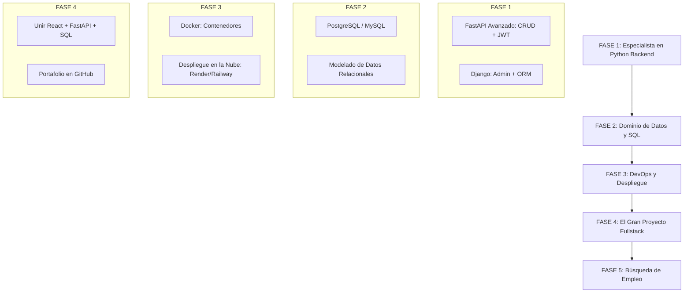

# 🗺️ Mapa de Ruta: De FastAPI a tu Primer Empleo

## 📘 Detalle de cada paso 1

1. **FASE 1**: Backend Pro (Lo que estás haciendo ahora)

*No te conformes con el "Hola Mundo".*

*Meta*: Crear una API (Con FastAPI) que tenga autenticación, manejo de errores real y que sea rápida.

*Django*: Aprende su panel de administración; es lo que más aman las empresas porque ahorra mucho tiempo.

2. **FASE 2**: La Ciencia de los Datos (SQL)

Has usado MongoDB (NoSQL), pero el 80% de las empresas usan SQL.

*Tarea*: Instala PostgreSQL en tu Termux.

*Concepto clave*: Aprende a normalizar tablas (que la información no se repita y esté bien conectada).

3. **FASE 3**: Docker y "La Nube" (Tu factor diferenciador)

*Aquí es donde dejas de ser un "estudiante" y te conviertes en "ingeniero".*

*Docker*: Aprende a crear un Dockerfile. Esto asegura que tu app de Termux funcione en cualquier servidor del mundo.

*Cloud*: Sube un proyecto a internet.

No hay nada más potente en una entrevista que decir: *"Aquí tienes el link de mi API funcionando en vivo"*.

4. **FASE 4**: El Proyecto Integrador (**Fullstack**)

*Usa lo que ya sabes de React.*

*Proyecto Sugerido*: Un "Sistema de Gestión de Inventario" o una "Red Social de Tareas".

*Frontend*: React (Vite).

*Backend*: FastAPI.

*Base de Datos*: PostgreSQL.

## 💼 ¿Cuándo empezar a buscar empleo?

*Mi recomendación* es que comiences la Fase 5 cuando tengas 3 Repositorios en GitHub bien presentados:

*README profesional*: Cada proyecto debe tener una explicación de qué hace, cómo se instala y capturas de pantalla.

*Código limpio*: Usa nombres de variables en inglés (es el estándar de la industria).
